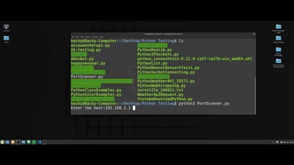

# PortScanner
Simple PortScanner With Python3  

<H1>Instructions</H1>
 

  
----------<b>Linux</b>------------- 
If you are running Linux/Ubuntu download the folder or only the file and run it 
with this command : python3 PortScanner.py  
(First open the folder with terminal and make an ls and after you must
type the command)

----------<b>Windows</b>------------- 
If you are running Windows download the folder or only the file and run it 
with this command :PortScanner.py  
You must have in /path python to work! 
If you don't have in /path check this <a href="https://datatofish.com/add-python-to-windows-path/">link</a> 

First open the folder copy C:\USER\XX\PortScanner\ from the top bar 

1. Type cd C:\USER\XX\PortScanner\ 
2. Type dir and you will see the file PortScanner.py
3. Type PortScanner.py or python PortScanner.py
 

